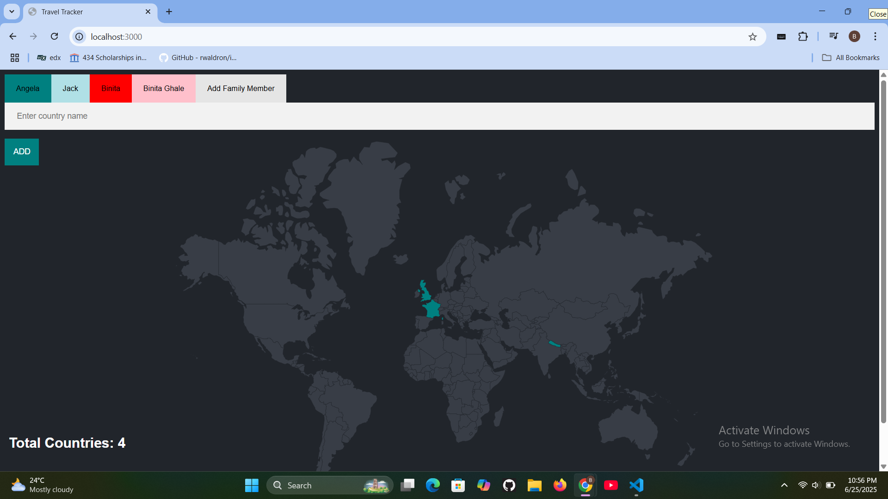
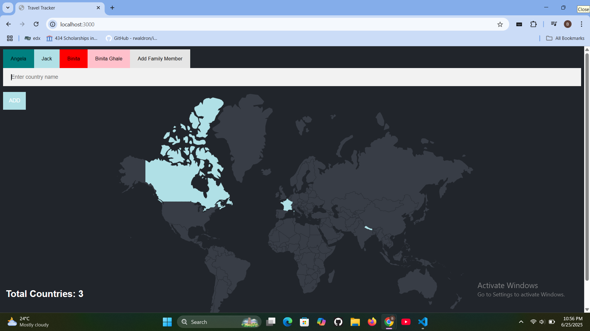
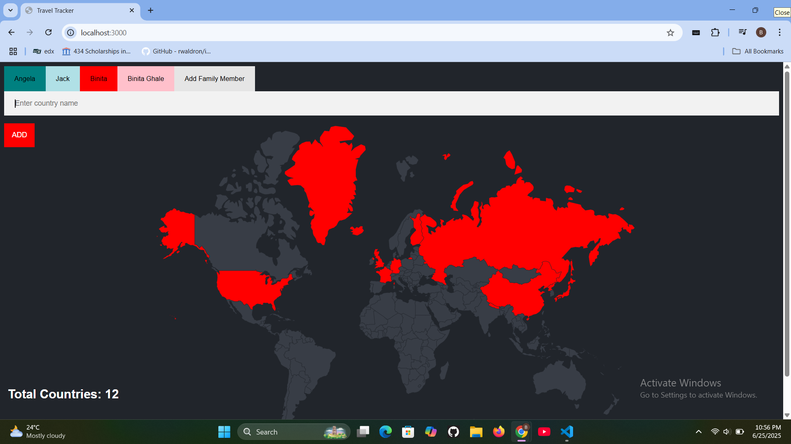
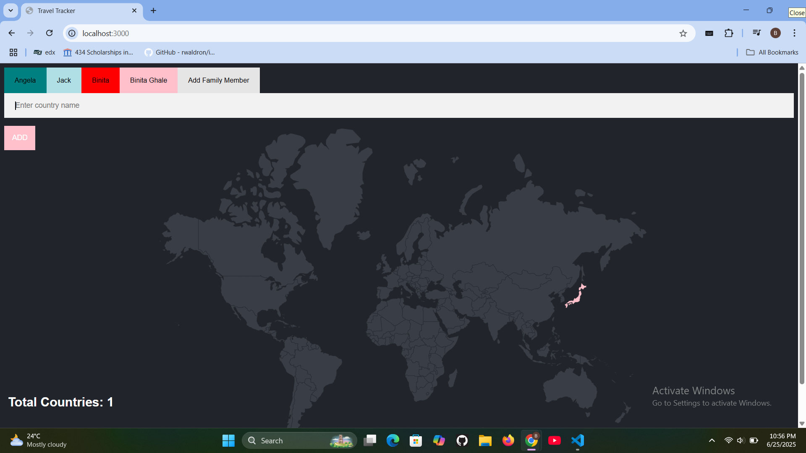
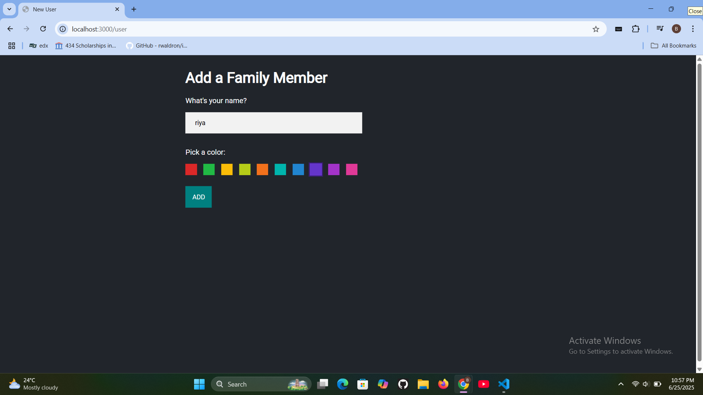
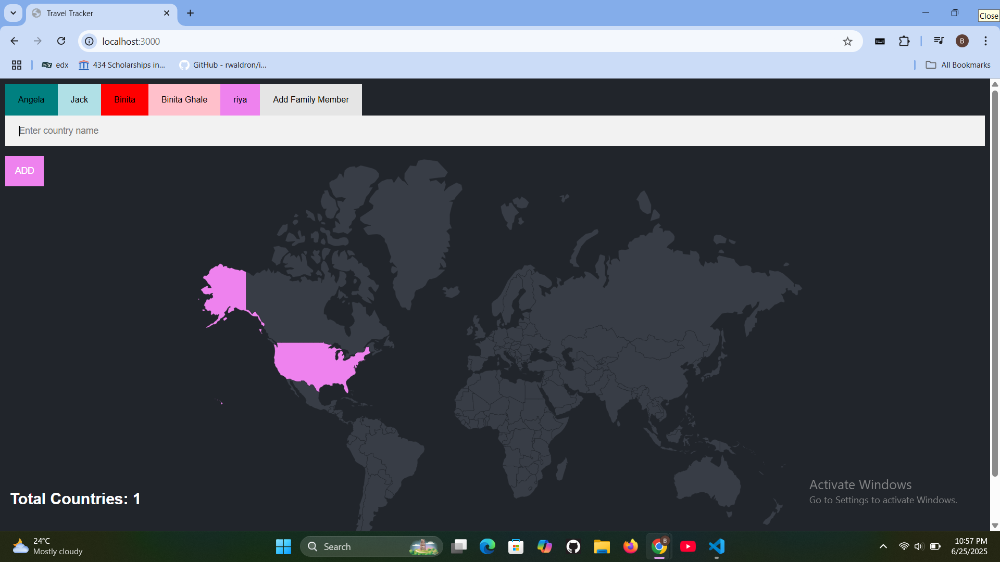

# ✈️ Family Travel Tracker

The **Family Travel Tracker** is a backend web app built using **Node.js**, **Express**, and **PostgreSQL**. Users can input their name and travel destination via a form, which is then saved into a PostgreSQL database and displayed back as a personalized travel message.

---








## 🚀 Features

- Accepts user input via an HTML form (Name + Destination)
- Saves the data into a PostgreSQL database
- Displays a custom message like:  
  `"Binita is traveling to Pokhara."`
- Uses Express for routing and `body-parser` to handle form submissions
- Uses `pg` Node package to connect to the PostgreSQL database

---

## 🛠️ Tech Stack

- **Node.js**
- **Express.js**
- **PostgreSQL**
- **pg (PostgreSQL Node.js client)**
- **HTML** (for frontend form)

---

## 📂 Project Structure

```
Family_Travel_Tracker/
├── index.js           # Main server logic with Express and PostgreSQL
├── package.json       # Project metadata and dependencies
├── views/             # HTML form (if present)
└── db/                # Optional folder for SQL scripts or DB configs
```

---

## ⚙️ How to Run Locally

### 1. Clone this repository

```bash
git clone https://github.com/binita54/Family_Travel_Tracker.git
cd Family_Travel_Tracker
```

### 2. Install dependencies

```bash
npm install
```

### 3. Set up PostgreSQL

- Make sure PostgreSQL is installed and running
- Create a database (e.g., `travel_db`)
- Create a table using this structure:

```sql
CREATE TABLE travelers (
  id SERIAL PRIMARY KEY,
  name TEXT,
  destination TEXT
);
```

- Update your connection config inside `index.js` if needed:

```js
const db = new Client({
  user: 'your_username',
  host: 'localhost',
  database: 'travel_db',
  password: 'your_password',
  port: 5432,
});
```

### 4. Run the server

```bash
nodemon index.js
```

### 5. Visit in browser

Go to: [http://localhost:3000](http://localhost:3000)  
Fill out the form → submit → you’ll be redirected to `/submit` where you’ll see your travel message!

---

## 🧠 What I Learned

- How to connect Node.js to a PostgreSQL database using `pg`
- Handling HTML forms with Express and body-parser
- Inserting and retrieving user data from a real database
- Building real-world full-stack backend logic

---

## 📄 License

This project is open-source and available under the [MIT License](LICENSE).

---

## 🙋‍♀️ Author

👩 **Binita**  
🔗 [GitHub Profile](https://github.com/binita54)

---

⭐ If you found this project helpful or interesting, drop a ⭐ to support!
